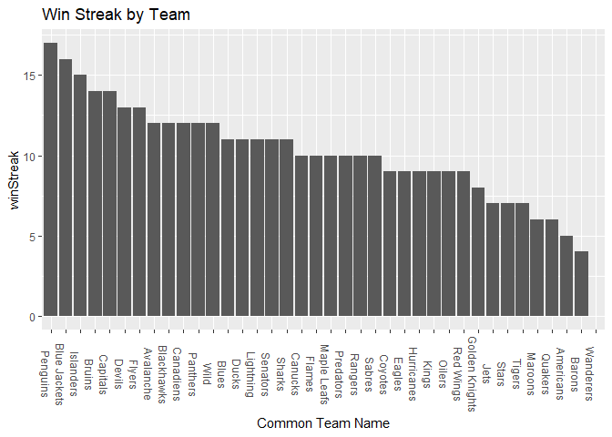
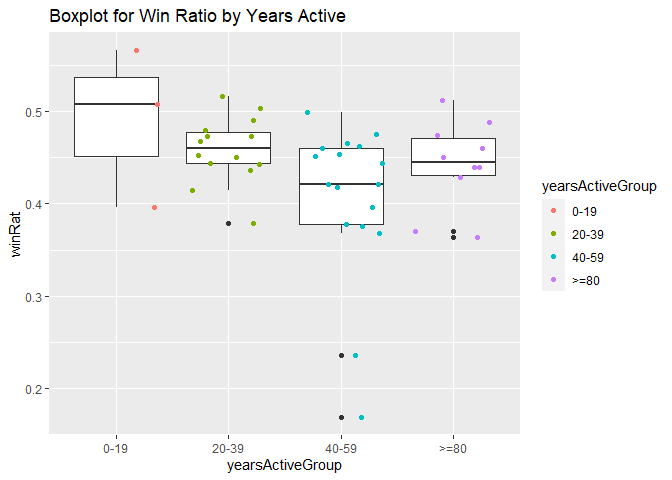
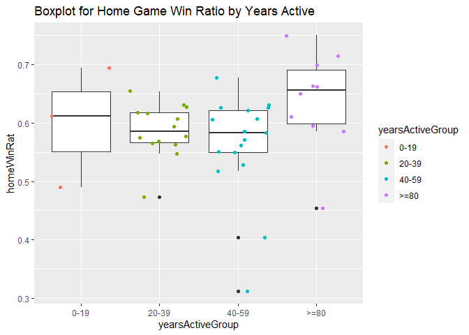
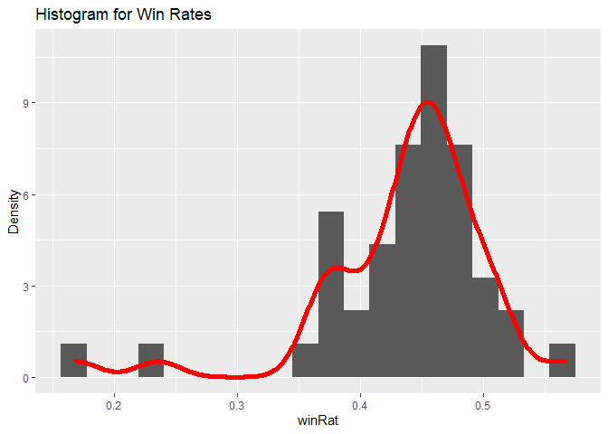

ST 558: Project 1
================
9/8/20

# Setup

## Libraries

You will need ‘httr’, ‘jsonlite’, ‘tidyverse’, and ‘knitr’ They are
added in at the beginning of the first chunk of code they are needed in.

# Data

## Records

To access the **NHL records** please use the *nhlRecords* function.
There is one required argument this is the name of the endpoint and an
optional argument as well. The optional argument is to call in a
specific franchise ID number. Using this created function I accessed
franchise, franchise-team-totals, franchise-season-records,
franchise-goalie-records, and franchise-skater-records. \#\# Stats To
access the **NHL stats** please use the *nhlStats* function. There are
technically no required arguments for this function. If used without
arguments it will take all of the stats data unmodified. For
modifications set modify equal to your desired modification. In addition
to this, some modifiers allow further modifying for teamID and season.
to capture a specific team, please set teamID equal desired ID number.
If specific seasons are desired set season equal to desired season year.
If multpiple seasons are desired please identify all season years side
by side without spaces. For example if you are interested in 2015 and
2016 then season=“20152016”. \#\# Wrapper Function To access either of
the above functions a wrapper function was created. If you are looking
for records set interest to your desired endpoint. If you are looking
for stats set interest to your desired modifier AND set stat=TRUE. The
additional arguments can be used as they would in the single functions.

``` r
library(httr)
library(jsonlite)
library(tidyverse)

# I created a function that calls a specific endpoint for the NHL API, and if applicable the franchise ID number
nhlRecords <- function(endpoint, franchiseID=NULL, franName=NULL){
  baseURL <- "https://records.nhl.com/site/api"
  mod <- "?cayenneExp=franchiseId="
  if(is.null(franchiseID) & !is.null(franName)){
    data <- GET(paste0(baseURL,"/",endpoint)) %>% content("text") %>% fromJSON(flatten=TRUE,simplifyDataFrame = TRUE) 
    data <- data[data$franchiseName==franName]
  } 
  if(is.null(franchiseID)){
    data <- GET(paste0(baseURL,"/",endpoint)) %>% content("text") %>% fromJSON(flatten=TRUE,simplifyDataFrame = TRUE)
  }
  else{
   data <- GET(paste0(baseURL,"/",endpoint,mod,franchiseID)) %>% content("text") %>% fromJSON(flatten=TRUE,simplifyDataFrame = TRUE)
  }
data
}

franchise <- "franchise"
franchise <- nhlRecords(endpoint=franchise)
teamTot <- "franchise-team-totals"
teamTot <- nhlRecords(teamTot)
seasonRec <- "franchise-season-records"
seasonRec<- nhlRecords(endpoint=seasonRec)
goalRec <- "franchise-goalie-records"
goalRec <- nhlRecords(endpoint=goalRec)
skateRec <- "franchise-skater-records"
skateRec <- nhlRecords(endpoint=skateRec)

nhlStats <- function(modifier=NULL, teamID=NULL, season=NULL){
  baseURL <- "https://statsapi.web.nhl.com/api/v1/teams" 
  if(!is.null(teamID)){
   data <- GET(paste0(baseURL,"?",modifier,"=",teamID)) %>% content("text") %>% fromJSON(flatten=TRUE,simplifyDataFrame = TRUE)
  }
  else if (!is.null(season)) {
  data <-  GET(paste0(baseURL,"?expand=",modifier,"=",season)) %>% content("text") %>% fromJSON(flatten=TRUE,simplifyDataFrame = TRUE)
  }  
  else {
    data <- GET(paste0(baseURL,"?expand=",modifier)) %>% content("text") %>%
      fromJSON(flatten=TRUE,simplifyDataFrame = TRUE)
  }
  data
}

# For simplification the endpoints and modifiers have been placed into a list for easy referencing.
endpoints <- c("franchise", "franchise-team-totals","franchise-season-records", "franchise-goalie-records", "franchise-skater-records")
modifier <- c("team.roster", "person.names", "team.schedule.next", "team.schedule.previous", "team.stats", "team.roster&season","teamID","stats=statsSingleSeasonPlayoffs")

# I created a wrapper function that uses both functions above. The user can return data from both records and stats. 
# If stats are desired rather than records please set stat = TRUE
nhlAPI <- function(interest, stat=FALSE,...){
  if(stat==FALSE){
   nhlRecords(endpoint=interest)
  }
  else {nhlStats(modifier=interest)}
}
```

# Exploring the Data

## Franchise and Season Data

First I joined the franchise endpoint and the season records endpoint. I
took the start year and end years and created frequency tables to see
frequency of wins and losses based on the years. I created some summary
tables to of win streaks and loss streaks. Then I created a descending
bar graph to see win streak by team.

``` r
library(knitr)
franchise$data <- rename(franchise$data,c("franchiseId"="id"))
franSeason <- inner_join(franchise$data,seasonRec$data,"franchiseId")
# creating new variables
franSeason$startYr <- substr(franSeason$firstSeasonId,1,4)
franSeason$endYr <- substr(franSeason$lastSeasonId,5,8)
franSeason <- mutate(franSeason, mostLossGroup = 
                       ifelse(mostLosses %in% 0:19,"0-19", 
                         ifelse(mostLosses %in% 20:39,"20-39",
                           ifelse(mostLosses %in% 40:59,"40-59",
                             ifelse(mostLosses %in% 60:79,"60-79",">=80")))))
franSeason <- mutate(franSeason,mostWinGroup =
                       ifelse(mostWins %in% 0:19,"0-19", 
                         ifelse(mostWins %in% 20:39,"20-39",
                            ifelse(mostWins %in% 40:59,"40-59",
                              ifelse(mostWins %in% 60:79,"60-79",">=80")))))
# frequency tables for most losses and most wins by start year.
kable(table(franSeason$mostLossGroup,franSeason$startYr), 
      caption = "Start Years by Most Lossess Groups")
```

|       | 1917 | 1919 | 1924 | 1925 | 1926 | 1967 | 1970 | 1972 | 1974 | 1979 | 1991 | 1992 | 1993 | 1998 | 1999 | 2000 | 2017 |
| :---- | ---: | ---: | ---: | ---: | ---: | ---: | ---: | ---: | ---: | ---: | ---: | ---: | ---: | ---: | ---: | ---: | ---: |
| 0-19  |    1 |    0 |    0 |    0 |    0 |    0 |    0 |    0 |    0 |    0 |    0 |    0 |    0 |    0 |    0 |    0 |    0 |
| 20-39 |    1 |    1 |    1 |    2 |    0 |    0 |    0 |    0 |    0 |    0 |    0 |    0 |    0 |    0 |    0 |    1 |    1 |
| 40-59 |    2 |    0 |    1 |    0 |    3 |    6 |    2 |    1 |    1 |    3 |    0 |    1 |    2 |    1 |    1 |    1 |    0 |
| 60-79 |    0 |    0 |    0 |    0 |    0 |    0 |    0 |    1 |    1 |    1 |    1 |    1 |    0 |    0 |    0 |    0 |    0 |

Start Years by Most Lossess Groups

``` r
kable(table(franSeason$mostWinGroup,franSeason$startYr), 
      caption = "Start Years by Most Wins Groups")
```

|       | 1917 | 1919 | 1924 | 1925 | 1926 | 1967 | 1970 | 1972 | 1974 | 1979 | 1991 | 1992 | 1993 | 1998 | 1999 | 2000 | 2017 |
| :---- | ---: | ---: | ---: | ---: | ---: | ---: | ---: | ---: | ---: | ---: | ---: | ---: | ---: | ---: | ---: | ---: | ---: |
| 0-19  |    1 |    1 |    0 |    2 |    0 |    0 |    0 |    0 |    0 |    0 |    0 |    0 |    0 |    0 |    0 |    0 |    0 |
| 20-39 |    1 |    0 |    1 |    0 |    0 |    1 |    0 |    0 |    0 |    0 |    0 |    0 |    0 |    0 |    0 |    0 |    0 |
| 40-59 |    1 |    0 |    1 |    0 |    2 |    5 |    2 |    2 |    2 |    4 |    1 |    1 |    2 |    1 |    1 |    2 |    1 |
| 60-79 |    1 |    0 |    0 |    0 |    1 |    0 |    0 |    0 |    0 |    0 |    0 |    1 |    0 |    0 |    0 |    0 |    0 |

Start Years by Most Wins Groups

``` r
#summary tables for win streaks and loss streaks
kable(round(do.call(cbind, lapply(select(franSeason,ends_with("WinStreak")),
                          summary)),2),caption = "Seasons: Win Streak Summary")
```

|         | homeWinStreak | roadWinStreak | winStreak |
| :------ | ------------: | ------------: | --------: |
| Min.    |             5 |          3.00 |       4.0 |
| 1st Qu. |             9 |          6.00 |       9.0 |
| Median  |            11 |          8.00 |      10.0 |
| Mean    |            11 |          7.43 |      10.3 |
| 3rd Qu. |            13 |          9.00 |      12.0 |
| Max.    |            23 |         12.00 |      17.0 |
| NA’s    |             1 |          1.00 |       1.0 |

Seasons: Win Streak Summary

``` r
kable(round(do.call(cbind, lapply(select(franSeason,ends_with("lossStreak")), 
                          summary)),2),caption = "Seasons: Loss Streak Summary")
```

|         | homeLossStreak | lossStreak | roadLossStreak |
| :------ | -------------: | ---------: | -------------: |
| Min.    |           2.00 |       4.00 |           3.00 |
| 1st Qu. |           6.00 |       9.00 |           8.00 |
| Median  |           7.00 |      10.00 |          11.00 |
| Mean    |           7.45 |      10.68 |          12.50 |
| 3rd Qu. |           9.00 |      13.00 |          13.75 |
| Max.    |          14.00 |      17.00 |          38.00 |

Seasons: Loss Streak Summary

``` r
# bar graph for win streak by team in descending order
g <- ggplot(data = franSeason)
g + geom_bar(aes(x = reorder(teamCommonName,-winStreak),y =winStreak), stat="identity") +
  theme(axis.text.x = element_text(angle=-90)) +  
  labs(title = "Win Streak by Team", x="Common Team Name")
```

<!-- -->

## Team Total stats by franchise

I combined the team total stats with the franchise information. I
created new variables to show the start year and end year. Using the
start year I was able to calculate the number of years were active as of
the current year. To explore this data based on years active I grouped
the active years by 20. In addition to this, I calculated the win rate
and the home win rate. Now we are able to explore the win rates based on
the amount of years the team has been active\! First we explore this
with box plots for both rates. We quickly notice that there are 0 teams
that have been active for 60-79 years, but we don’t notice an immediate
trend. It does look like teams active for more than 80 years may have an
overall better win rate for home games, but we can’t be too sure. Next
we can explore the win rate using a histogram. In general, we can see
that the rates tend to be in between 0.4 and 0.5. Lastly, we can explore
both the win rate and the home win rate together using a scatter plot.
We can see that as the win rate increases the home win rate generally
increases as well, which may indicate teams do better at their home.

``` r
franTeam <- left_join(teamTot$data,franchise$data,
                      c("franchiseId","firstSeasonId","lastSeasonId"))
franTeam$startYr <- as.numeric(substr(franTeam$firstSeasonId,1,4))
franTeam$endYr <- substr(franTeam$lastSeasonId,5,8)
currentYr <- as.integer(format(Sys.Date(),"%Y"))
# calculate years active
# calculates win rate
# calculate home win rate
activeTeams <- filter(franTeam, activeFranchise==1) %>% 
  mutate(yearsActive = (currentYr - startYr)) %>% 
  mutate(winRat=wins/gamesPlayed) %>% 
  mutate(homeWinRat = homeWins / (homeLosses+homeWins))
# create groups for years active and make them ordered
activeTeams <- mutate(activeTeams, yearsActiveGroup =
                        ifelse(yearsActive %in% 0:19,"0-19", 
                          ifelse(yearsActive %in% 20:39,"20-39",
                             ifelse(yearsActive %in% 40:59,"40-59",
                               ifelse(yearsActive %in% 60:79,"60-79",">=80")))))
activeTeams$yearsActiveGroup <- factor(activeTeams$yearsActiveGroup,
                             levels = c("0-19","20-39","40-59","60-79",">=80"))
# filter for regular games
activeTeamsRSeas <- filter(activeTeams,gameTypeId==2) 
g <- ggplot(data = activeTeamsRSeas, aes(x=yearsActiveGroup))
# Box plo2t for win rates
g + geom_boxplot(aes(y=winRat)) +
  geom_jitter(aes(y=winRat, color = yearsActiveGroup))+
  labs(title="Boxplot for Win Ratio by Years Active")
```

<!-- -->

``` r
# Box Plot for home win rates
g + geom_boxplot(aes(y=homeWinRat)) +
  geom_jitter(aes(y=homeWinRat, color = yearsActiveGroup))+
  labs(title="Boxplot for Home Game Win Ratio by Years Active")
```

<!-- -->

``` r
# Histogram for Win Rates
g <- ggplot(data = activeTeamsRSeas, aes(x=winRat))
g + geom_histogram(aes(y=..density..), bins=20) +
  geom_density(alpha=0.8, size =2, color = "red") +
  labs(title = "Histogram for Win Rates", y="Density")
```

<!-- -->

``` r
# Scatterplot
# colors found at "http://www.stat.columbia.edu/~tzheng/files/Rcolor.pdf"
g <- ggplot(data = activeTeamsRSeas, aes(x = winRat,y = homeWinRat))
g + geom_point(aes(color = yearsActiveGroup)) +
  geom_smooth(aes(group=yearsActiveGroup),method=lm, col="paleturquoise3") +
  labs(title = "Win Rate vs Home Win Ratio")
```

    ## `geom_smooth()` using formula 'y ~ x'

<!-- -->
